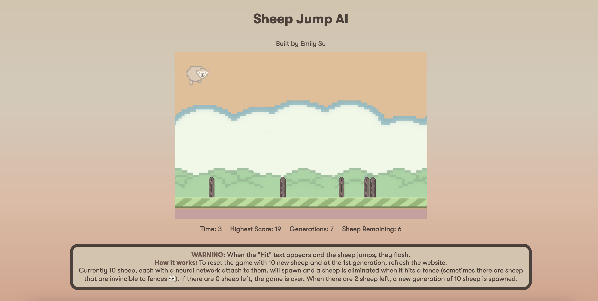

# Sheep Jump AI (Work in Progress)

Sheep Jump AI is an AI that plays a game where sheep—each being a neural network—jump to avoid fences and learns using the genetic algorithm. Implementation of the genetic algorithm is a work in progress right now.

Inclusion of fitness, more friendly UI, features for more interactivity such as ability to adjust population size, and much more coming soon!

Game is inspired by Google Chrome's dinosaur game but with sheeps, fences, and an AI! 

## How The Game Works (Work in Progress)

Currently 100 sheeps/100 neural networks spawn and one of them are eliminated when they hit a fence. If there are 0 sheeps left, the game is over and when there are 2 sheeps left, a new generation of sheeps are created. 

## How the Algorithm Works

Coming soon!

## Tools Used and More

Built using p5.js, JavasScript, Daniel Shiffman's Neural Network Library, and Aseprite. Sheep and fence graphics created by me and background and ground graphics were redesigned from Flappy Bird.
